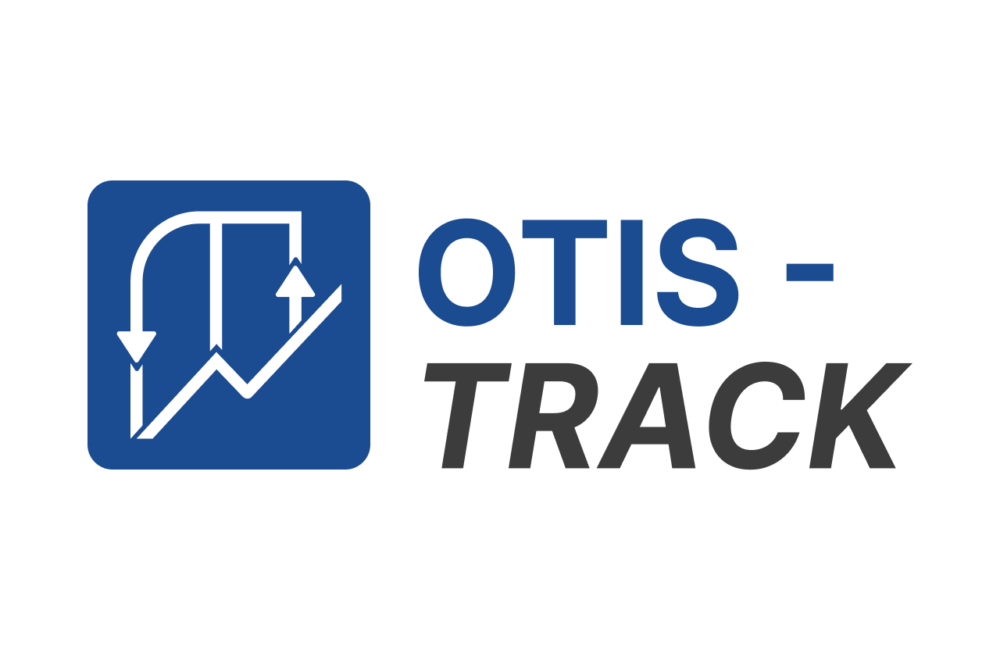

<p align="center">
  
</p>

# OTIS-TRACK

Plataforma para gestão de instalações de elevadores na América Latina — proporcionando previsibilidade, controle e transparência do início ao fim.

## 🌍 Visão Geral

O **OTIS-TRACK** é um protótipo de plataforma web que simula a gestão de instalações de elevadores.  
Os dados exibidos são fictícios e servem apenas para demonstração da interface e da experiência do usuário.  

🔑 Objetivos do protótipo:
- 🕓 **Previsibilidade e controle ponta a ponta**  
- 🔄 **Menos atrasos e retrabalho**, com processos unificados  
- 👥 **Transparência para o cliente**  
- 📈 **Feedback/NPS para melhoria contínua**  

👉 Versão online disponível em: [OTIS-TRACK](https://ottis-track.vercel.app/)  

---

## 🚀 Funcionalidades

- **Dashboard central** com visão de projetos  
- **Cards interativos** para status de instalação
- **Navegação simulada** entre seções do sistema  
- **Feedback/NPS fictício** para simular avaliação de clientes  

---

## 🛠️ Tecnologias Utilizadas

- **HTML5**  
- **CSS3** 
- **JavaScript**

> Não há backend — todos os dados são fictícios e carregados diretamente no front-end.  

---

## 📂 Estrutura do Projeto

```
/otis-track
├─ index.html # Página principal
├─ /pages # Páginas HTML
│ └─ client-portal.html
│ └─ dashboard.html
│ └─ project.html
│ └─ projects.html
├─ /css # Arquivos de estilo
│ └─ client-portal.css
│ └─ dashboard.css
│ └─ index.css
│ └─ project.css
│ └─ styles.css
├─ /js # Scripts JS
│ └─ client-portal.js
│ └─ common.js
│ └─ dashboard.js
│ └─ data.js
│ └─ project.js
├─ /img # ícones.
└─ README.md # Documentação
```

## 📌 Próximos Passos (Ideias de Evolução)
- Adicionar backend real para armazenamento de dados
- Implementar autenticação de usuários
- Conectar com banco de dados
- Criar API para integração com sistemas externos
- Melhorar relatórios com gráficos dinâmicos
